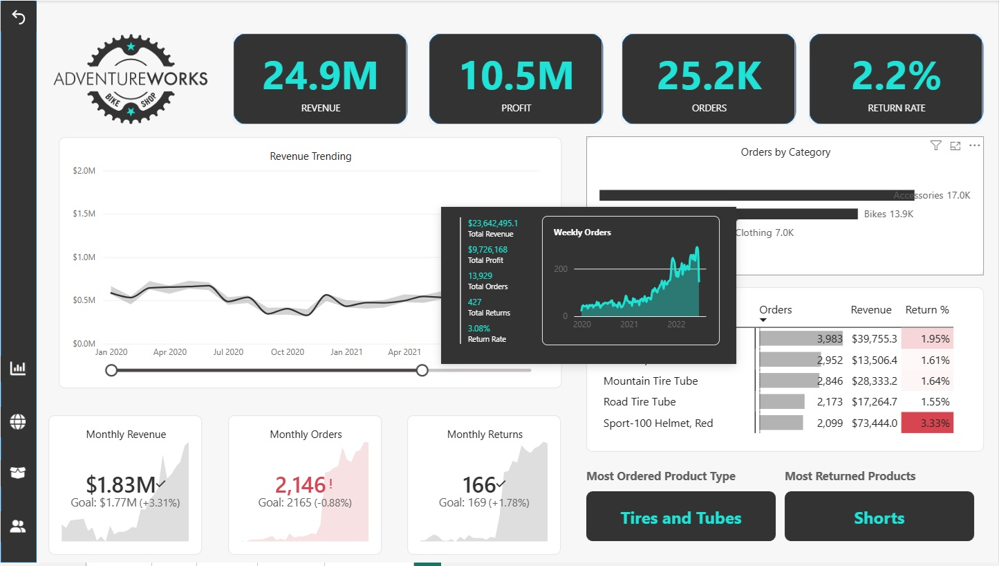
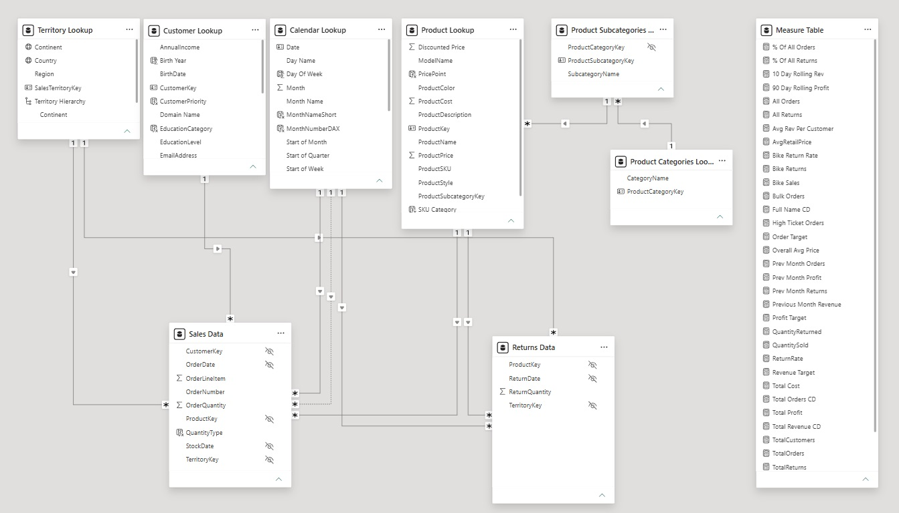

# 📊 AdventureWorks Business Intelligence Project (Power BI)

## 🧩 Introduction

In this project, I assumed the role of a **Business Intelligence Analyst** for *AdventureWorks Cycles*, a fictional manufacturing company. The goal was to transform raw, unstructured data into professional, insight-driven dashboards that support strategic decision-making. The final solution enables tracking of **KPIs**, comparison of **regional performance**, analysis of **product-level trends**, and identification of **high-value customers**.

---

## 🚀 Skills Highlighted

This project demonstrates strong capabilities in **Power Query (ETL)** for data extraction and transformation, as well as building scalable relational data models using **Star Schema** principles. It highlights proficiency in **DAX** for creating calculated measures and implementing **Time Intelligence**, along with the ability to design interactive dashboards following **Data Visualization best practices**. The work also reflects **analytical thinking**, **KPI development**, and the ability to translate business needs into actionable insights.

---

## 📈 Overview

### 🔹 Stage 1: Connecting & Shaping Data

The first stage focused on building automated data preparation workflows using **Power Query**. Data was extracted from multiple sources, including **databases** and **web sources**, then cleaned and transformed using **table transformations**, **data profiling tools**, and **query editing features**. Operations included handling **text, numerical, and date/time data**, creating **rolling calendars**, generating **index and conditional columns**, and performing **grouping, aggregation, pivoting, and unpivoting**. Queries were combined using **merge and append operations**, and **parameters** were introduced to enhance flexibility and automation.

---

### 🔹 Stage 2: Creating a Relational Data Model

In the second stage, the focus shifted to designing an efficient data model structured around **fact and dimension tables**. The model followed **normalization principles** and a **Star Schema design**, with relationships defined using **primary and foreign keys**. Special attention was given to **cardinality**, **filter context and flow**, and the use of **active and inactive relationships**. Additional enhancements included implementing **hierarchies**, optimizing **model layout**, and applying proper **data formatting and categorization**.

---

### 🔹 Stage 3: Adding Calculated Fields with DAX

The third stage involved enriching the model with calculated columns and measures using **DAX**. This required a deep understanding of **row context** and **filter context**, as well as building reusable calculations with **logical and conditional functions**. Advanced techniques included the use of **CALCULATE**, **FILTER**, and **ALL** to manipulate evaluation context, along with **iterator (X) functions** for row-based calculations. The implementation of **Time Intelligence patterns** enabled period-over-period comparisons and trend analysis.

---

### 🔹 Stage 4: Visualizing Data with Reports

The final stage focused on building interactive dashboards using **Power BI**:

* Executive Dashboard,
* Map Dashboard,
* Product Dashboard,
*  Customer Dashboard.

Reports were designed following **data visualization best practices**, incorporating **KPI cards**, **line charts**, **trendlines**, and **matrix visuals**. Interactivity was achieved through **slicers**, **drill-down and drillthrough features**, **bookmarks**, and **navigation elements**. Additional enhancements such as **conditional formatting**, **custom tooltips**, and **map visuals** improved clarity and storytelling. The solution also included **Row-Level Security (RLS)**, **mobile optimization**, and publishing to the **Power BI Service**.

---

## ✅ Conclusion

This project represents a complete end-to-end Business Intelligence workflow, demonstrating the ability to transform raw data into meaningful insights through **ETL processes**, **data modeling**, **DAX calculations**, and **interactive dashboards**. It reflects both technical proficiency and a strong understanding of how data supports business strategy and performance optimization.
